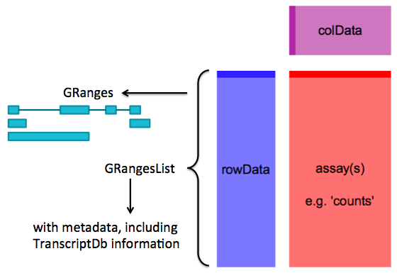
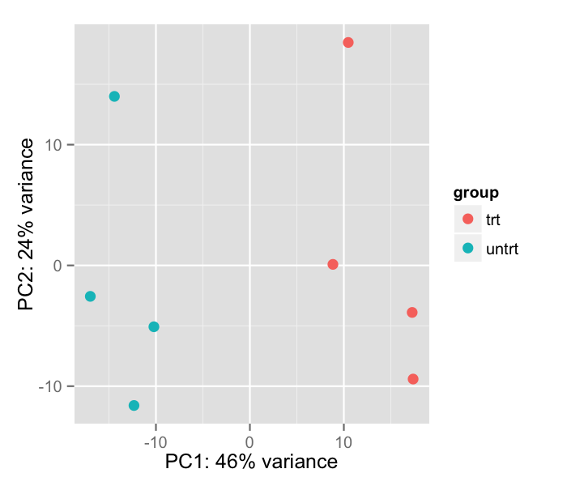
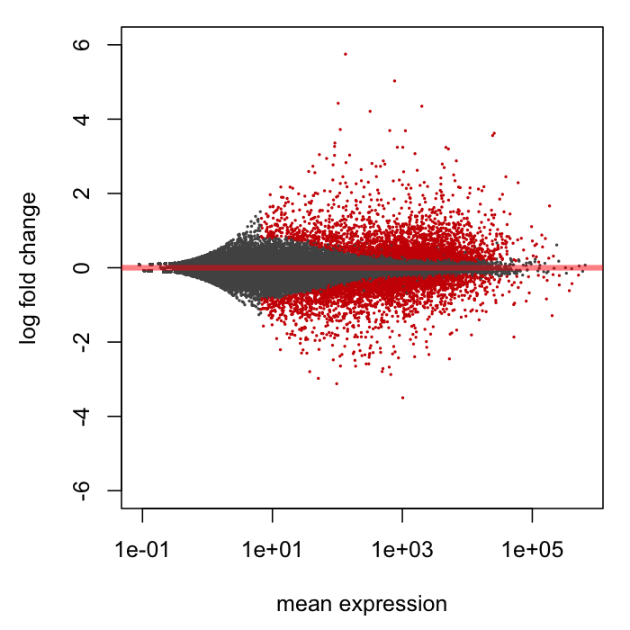
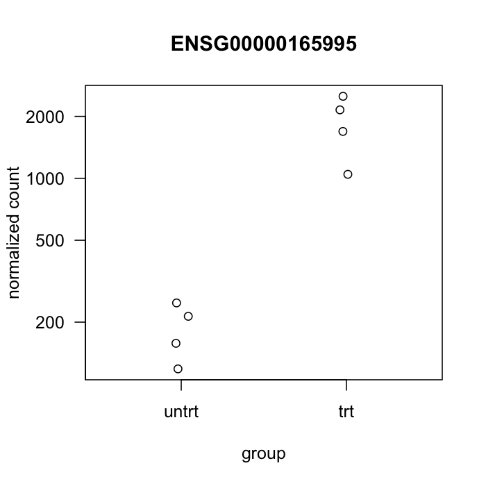
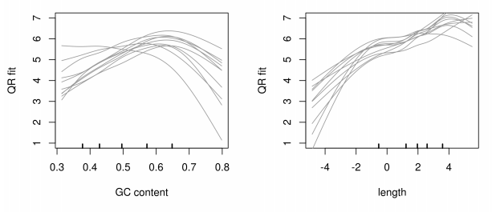
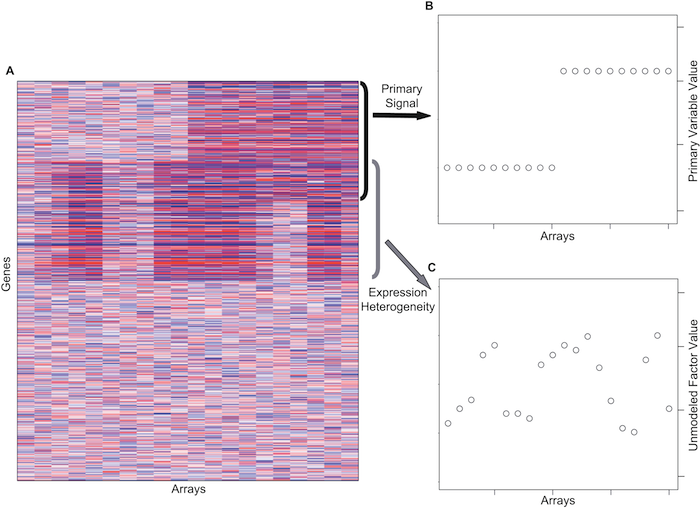
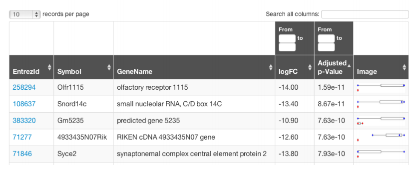

# Bioconductor RNA-Seq workflow

-*Michael Love*, dept. biostat., HSPH/DFCI

1. preparing gene models
2. read counting
3. EDA (exploratory data analysis)
4. differential expression analysis
5. annotating results

slides and code:

- [mikelove.github.io/biocrnaseq](http://mikelove.github.io/biocrnaseq)
- [github.com/mikelove/biocrnaseq](http://github.com/mikelove/biocrnaseq)

---

# What's not covered here

- read alignment
- de novo feature identification
- differential exon usage / differential isoform expression

---

# Preparing gene models

<br><br>

```{r, eval=FALSE}
library( "GenomicFeatures" )
# takes ~10 min
txdb <- makeTranscriptDbFromBiomart( biomart="ensembl",
                                    dataset="hsapiens_gene_ensembl" )
```

smart to use `saveDb()` to only do this once

- [GenomicFeatures](http://www.bioconductor.org/packages/release/bioc/html/GenomicFeatures.html)

---

# Preparing gene models

<br><br>

- `makeTranscriptDbFromGFF()` accepts GTF files
- `library(TxDb.Hsapiens.UCSC.hg19.knownGene)` ready to go
- soon `AnnotationHub` will offer ready to go

---

# Extract exons for each gene

```{r, echo=FALSE, messages=FALSE}
library("GenomicRanges")
library("parathyroidSE")
data(parathyroidGenesSE)
se <- parathyroidGenesSE
exonsByGene <- rowData(se)
```

```{r, eval=FALSE}
# takes ~30 seconds
exonsByGene <- exonsBy( txdb, by="gene" )
```

```{r}
exonsByGene[[ 1 ]][ 1:4 ]
```

---

# Super useful

<br><br>

To convert from `chrX` to `X` and back:

```{r, eval=FALSE}
seqlevelsStyle(gr) <- "NCBI"
seqlevelsStyle(gr) <- "UCSC"
```

---


# Read counting

<br><br>

`yieldSize` for controlling memory:

```{r, eval=FALSE}
samples <- read.csv( "sample_data.csv" )
fls <- samples$filename
library( "Rsamtools" )
bamLst <- BamFileList( fls, yieldSize=2000000 )
```

- [Rsamtools](http://www.bioconductor.org/packages/release/bioc/html/Rsamtools.html)

---

# Read counting

```{r, eval=FALSE}
library( "GenomicAlignments" )
register( MulticoreParam( workers=4 ) )
# takes e.g. ~30 minutes per sample for 40 million PE reads 
se <- summarizeOverlaps( features=exonsByGene,
                        reads=bamLst,
                        mode="Union",
                        singleEnd=FALSE,
                        ignore.strand=TRUE,
                        fragments=TRUE )
```

- [GenomicAlignments](http://www.bioconductor.org/packages/release/bioc/html/GenomicAlignments.html)
- [htseq-count](http://www-huber.embl.de/users/anders/HTSeq/doc/count.html): python library
- [Rsubread](http://www.bioconductor.org/packages/release/bioc/html/Rsubread.html): `featureCounts()`
- [easyRNASeq](http://www.bioconductor.org/packages/release/bioc/html/easyRNASeq.html)

---

# SummarizedExperiment

<center></center>

---

# Metadata stored without user effort

```{r}
metadata( rowData( se ) )[[ 1 ]][ 1:6 ]
```

---

# Add sample data

<br><br>

`DataFrame` is a powerful data frame defined in `IRanges`:

```{r, eval=FALSE}
colData( se ) <- DataFrame( samples )
```

---

# Exploratory data analysis (EDA)

```{r, eval=FALSE}
dds <- DESeqDataSet( se, ~ group + condition )
rld <- rlog( dds )
plotPCA( rld, intgroup="condition" )
```

<center></center>

---

# Differential expression analysis

- [DESeq2](http://www.bioconductor.org/packages/release/bioc/html/DESeq2.html)
- [DEXSeq](http://www.bioconductor.org/packages/release/bioc/html/DEXSeq.html)
differential exon usage
- [edgeR](http://www.bioconductor.org/packages/release/bioc/html/edgeR.html)
- [limma](http://www.bioconductor.org/packages/release/bioc/html/limma.html) + voom transformation
- [DSS](http://www.bioconductor.org/packages/release/bioc/html/DSS.html)
- [BitSeq](http://www.bioconductor.org/packages/release/bioc/html/BitSeq.html)
transcript expression inference
- [cummeRbund](http://www.bioconductor.org/packages/release/bioc/html/cummeRbund.html)
  import and visualize Cufflinks results
- [monocle](http://www.bioconductor.org/packages/devel/bioc/html/monocle.html) single-cell
- [and more](http://bioconductor.org/packages/release/BiocViews.html#___RNASeq)

---

# The generalized linear model

<br>

\[ K_{ij} \sim \text{NB}( \mu_{ij}, \alpha_i )  \]

- Read count $K_{ij}$ for gene *i* sample *j*.
- 2 parameter count distribution: mean $\mu$, dispersion $\alpha$

\[ \mu_{ij} = s_{ij} q_{ij} \]

- Normalized by size factor $s_{ij}$, with $q_{ij}$ remaining
- Often size factor $s_j$

---

# The generalized linear model

<br>

\[ \log q_{ij} = \sum_r x_{jr} \beta_{ir} \]

\[ \begin{array}{c}
\log q_1 \\
\log q_2 \\
\log q_3 \\
\log q_4 \end{array}
= \left( \begin{array}{cc}
1 & 0 \\
1 & 0 \\
1 & 1 \\
1 & 1 \end{array} \right)
\left( \begin{array}{c}
\beta_0 \\
\beta_1 \end{array} \right) \] 

* results are logarithm base 2 fold changes 

---

# Multigroup comparisons in DESeq2

<br><br>

\[ \begin{array}{c}
\log q_1 \\
\log q_2 \\
\log q_3 \\
\log q_4 \\
\log q_5 \\
\log q_6 \end{array}
= \left( \begin{array}{cccc}
1 & 1 & 0 & 0 \\
1 & 1 & 0 & 0 \\
1 & 0 & 1 & 0 \\
1 & 0 & 1 & 0 \\
1 & 0 & 0 & 1 \\
1 & 0 & 0 & 1 \\ \end{array} \right)
\left( \begin{array}{c}
\beta_0 \\
\beta_1 \\
\beta_2 \\
\beta_3 \end{array} \right) \] 

- code and slides on GTEx tissues: [github.com/mikelove/multigroup](https://github.com/mikelove/multigroup)

---

# Differential expression analysis

```{r, eval=FALSE}
# takes e.g. ~25 seconds for 8 samples, 35,000 genes
dds <- DESeq( dds )
res <- results( dds )
res <- results( dds, contrast=c("condition","trt","untrt") )
plotMA( res )
```

<center></center>

---

# Plot counts for a single gene

```{r, eval=FALSE}
gene <- rownames( res )[ order( res$pvalue ) ][ 1 ]
plotCounts( dds, gene, "condition" )
```

<center></center>

in *DESeq2* >= v1.5

---

# Normalization for sample-specific GC and transcript length

- [cqn](http://www.bioconductor.org/packages/release/bioc/html/cqn.html)
conditional quantile normalization
- [EDASeq](http://www.bioconductor.org/packages/release/bioc/html/EDASeq.html)

<center></center>

-*cqn* package vignette

---

# Controlling for unknown batch

<br><br>

- [sva](http://www.bioconductor.org/packages/release/bioc/html/sva.html): `svaseq()`
surrogate variable analysis
- [RUVSeq](http://www.bioconductor.org/packages/release/bioc/html/RUVSeq.html):
remove unwanted variation

return a matrix with columns which are surrogate variables

---

# Controlling for unknown batch

<center></center>

[Leek and Storey (2007)](http://dx.doi.org/10.1371/journal.pgen.0030161)

---

# ReportingTools

<br><br>

```{r, eval=FALSE}
rprt <- HTMLReport(shortName = "analysis",
                   title = "RNA-Seq analysis",
                   reportDirectory = "./reports")
publish(res, rprt,
        DataSet=dds,
        annotation.db="org.Hs.eg.db")
finish(rprt)
```

- [ReportingTools](http://www.bioconductor.org/packages/release/bioc/html/ReportingTools.html)

---

# ReportingTools

<br><br>

<center></center>

---

# Manual annotation

<br><br>

- [biomaRt](http://www.bioconductor.org/packages/release/bioc/html/biomaRt.html)
- [AnnotationDbi](http://www.bioconductor.org/packages/release/bioc/html/AnnotationDbi.html): `select()` works with the annotation packages `org.Hs.eg.db`:

```{r, eval=FALSE}
tab <- select(org.Hs.eg.db, genes, "SYMBOL", "ENSEMBL")
```

---

# Support

- mailing list:
    1. package name in title
    2. describe experiment, what's the *biological question*
    3. provide code
    4. sessionInfo()
- `browseVignettes("pkg")`
- `?function`

---

# Acknowledgments

- Bioconductor core team
- *DESeq*/*DEXSeq* team
    - Simon Anders
    - Alejandro Reyes
    - Wolfgang Huber
- Rafael Irizarry

