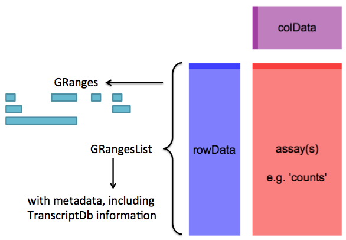

# Bioconductor RNA-Seq workflow

1. preparing gene models
2. read counting
3. EDA (exploratory data analysis)
4. differential expression analysis
5. annotating results

---

# Preparing gene models


```r
library( "GenomicFeatures" )
# takes ~10 min
txdb <- makeTranscriptDbFromBiomart( biomart="ensembl",
                                    dataset="hsapiens_gene_ensembl" )
```

smart to use `saveDb()` to only do this once

- [GenomicFeatures](http://www.bioconductor.org/packages/release/bioc/html/GenomicFeatures.html)

---

# Preparing gene models

- `makeTranscriptDbFromGFF()` accepts GTF
- `library(TxDb.Hsapiens.UCSC.hg19.knownGene)` ready to go
- soon also, `AnnotationDbi` will offer ready to go

---

# Super useful


```r
seqlevelsStyle(gr) <- "NCBI"
seqlevelsStyle(gr) <- "UCSC"
```

---

# Extract exons for each gene


```r
# takes ~30 seconds
exonsByGene <- exonsBy( txdb, by="gene" )
```


```r
exonsByGene
```

```
## GRangesList of length 100:
## $ENSG00000000003 
## GRanges with 17 ranges and 2 metadata columns:
##        seqnames               ranges strand   |   exon_id       exon_name
##           <Rle>            <IRanges>  <Rle>   | <integer>     <character>
##    [1]        X [99883667, 99884983]      -   |    664095 ENSE00001459322
##    [2]        X [99885756, 99885863]      -   |    664096 ENSE00000868868
##    [3]        X [99887482, 99887565]      -   |    664097 ENSE00000401072
##    [4]        X [99887538, 99887565]      -   |    664098 ENSE00001849132
##    [5]        X [99888402, 99888536]      -   |    664099 ENSE00003554016
##    ...      ...                  ...    ... ...       ...             ...
##   [13]        X [99890555, 99890743]      -   |    664106 ENSE00003512331
##   [14]        X [99891188, 99891686]      -   |    664108 ENSE00001886883
##   [15]        X [99891605, 99891803]      -   |    664109 ENSE00001855382
##   [16]        X [99891790, 99892101]      -   |    664110 ENSE00001863395
##   [17]        X [99894942, 99894988]      -   |    664111 ENSE00001828996
## 
## ...
## <99 more elements>
## ---
## seqlengths:
##                  1                 2 ...            LRG_99
##          249250621         243199373 ...             13294
```

---

# Read counting


```r
library( "Rsamtools" )
bamLst <- BamFileList( fls, yieldSize=2000000 )
```

- [Rsamtools](http://www.bioconductor.org/packages/release/bioc/html/Rsamtools.html)

---

# Read counting


```r
library( "GenomicAlignments" )
register( MulticoreParam( workers=4 ) )
# takes e.g. ~30 minutes per sample for 40 million PE reads 
se <- summarizeOverlaps( features=exonsByGene,
                        reads=bamLst,
                        mode="Union",
                        singleEnd=FALSE,
                        ignore.strand=TRUE,
                        fragments=TRUE )
```

- [GenomicAlignments](http://www.bioconductor.org/packages/release/bioc/html/GenomicAlignments.html)

---

# SummarizedExperiment

<center></center>

---

# Metadata stored without user effort


```r
metadata( rowData( se ) )
```

```
## $genomeInfo
## $genomeInfo$`Db type`
## [1] "TranscriptDb"
## 
## $genomeInfo$`Supporting package`
## [1] "GenomicFeatures"
## 
## $genomeInfo$`Data source`
## [1] "BioMart"
## 
## $genomeInfo$Organism
## [1] "Homo sapiens"
## 
## $genomeInfo$`Resource URL`
## [1] "www.biomart.org:80"
## 
## $genomeInfo$`BioMart database`
## [1] "ensembl"
## 
## $genomeInfo$`BioMart database version`
## [1] "ENSEMBL GENES 72 (SANGER UK)"
## 
## $genomeInfo$`BioMart dataset`
## [1] "hsapiens_gene_ensembl"
## 
## $genomeInfo$`BioMart dataset description`
## [1] "Homo sapiens genes (GRCh37.p11)"
## 
## $genomeInfo$`BioMart dataset version`
## [1] "GRCh37.p11"
## 
## $genomeInfo$`Full dataset`
## [1] "yes"
## 
## $genomeInfo$`miRBase build ID`
## [1] NA
## 
## $genomeInfo$transcript_nrow
## [1] "213140"
## 
## $genomeInfo$exon_nrow
## [1] "737783"
## 
## $genomeInfo$cds_nrow
## [1] "531154"
## 
## $genomeInfo$`Db created by`
## [1] "GenomicFeatures package from Bioconductor"
## 
## $genomeInfo$`Creation time`
## [1] "2013-07-30 17:30:25 +0200 (Tue, 30 Jul 2013)"
## 
## $genomeInfo$`GenomicFeatures version at creation time`
## [1] "1.13.21"
## 
## $genomeInfo$`RSQLite version at creation time`
## [1] "0.11.4"
## 
## $genomeInfo$DBSCHEMAVERSION
## [1] "1.0"
```

---

# Add sample data


```r
samples <- read.csv( "sample_data.csv" )
colData( se ) <- DataFrame( samples )
```

---

# Exploratory data analysis (EDA)


```r
dds <- DESeqDataSet( se, ~ group + condition )
rld <- rlog( dds )
plotPCA( rld )
```

<center></center>

---

# Differential expression analysis

- [DESeq2](http://www.bioconductor.org/packages/release/bioc/html/DESeq2.html)
- [edgeR](http://www.bioconductor.org/packages/release/bioc/html/edgeR.html)
- [limma](http://www.bioconductor.org/packages/release/bioc/html/limma.html) + voom normalization
- [DSS](http://www.bioconductor.org/packages/release/bioc/html/DSS.html)
- [BitSeq](http://www.bioconductor.org/packages/release/bioc/html/BitSeq.html)
transcript expression inference

---

# The generalized linear model

\[ K_{ij} \sim \text{NB}( \mu_{ij}, \alpha_i )  \]

- Read count $K_{ij}$ for gene *i* sample *j*.
- 2 parameter count distribution: mean $\mu$, dispersion $\alpha$

\[ \mu_{ij} = s_{ij} q_{ij} \]

- Normalized by size factor $s_{ij}$, with $q_{ij}$ remaining
- Often size factor $s_j$

---

# The generalized linear model

\[ \log q_{ij} = \sum_r x_{jr} \beta_{ir} \]

\[ \begin{array}{c}
\log q_1 \\
\log q_2 \\
\log q_3 \\
\log q_4 \end{array}
= \left( \begin{array}{cc}
1 & 0 \\
1 & 0 \\
1 & 1 \\
1 & 1 \end{array} \right)
\left( \begin{array}{c}
\beta_0 \\
\beta_1 \end{array} \right) \] 

* results are logarithm base 2 fold changes 

---

# Multigroup comparisons in DESeq2

\[ \begin{array}{c}
\log q_1 \\
\log q_2 \\
\log q_3 \\
\log q_4 \\
\log q_5 \\
\log q_6 \end{array}
= \left( \begin{array}{cccc}
1 & 1 & 0 & 0 \\
1 & 1 & 0 & 0 \\
1 & 0 & 1 & 0 \\
1 & 0 & 1 & 0 \\
1 & 0 & 0 & 1 \\
1 & 0 & 0 & 1 \\ \end{array} \right)
\left( \begin{array}{c}
\beta_0 \\
\beta_1 \\
\beta_2 \\
\beta_3 \end{array} \right) \] 

---

# Differential expression analysis


```r
# takes e.g. ~25 seconds for 8 samples, 35,000 genes
dds <- DESeq( dds )
res <- results( dds )
res <- results( dds, contrast=c("condition","trt","untrt") )
plotMA( res )
```

<center></center>

---

# Normalization for sample-specific GC and transcript length

- [cqn](http://www.bioconductor.org/packages/release/bioc/html/cqn.html)
conditional quantile normalization
- [EDASeq](http://www.bioconductor.org/packages/release/bioc/html/EDASeq.html)

<center></center>

<center>cqn package vignette</center>

---

# Controlling for unknown batch

- [sva](http://www.bioconductor.org/packages/release/bioc/html/sva.html): `svaseq()`
surrogate variable analysis
- [RUVSeq](http://www.bioconductor.org/packages/release/bioc/html/RUVSeq.html):
remove unwanted variation

returns a matrix with columns which are surrogate variables

---

# Controlling for unknown batch

<center></center>

[Leek and Storey (2007)](http://dx.doi.org/10.1371/journal.pgen.0030161)

---

# ReportingTools


```r
rprt <- HTMLReport(shortName = "analysis",
                   title = "RNA-Seq analysis",
                   reportDirectory = "./reports")
publish(dds, rprt, pvalueCutoff=0.1,
        annotation.db="org.Hs.eg.db",
        factor = dds$condition,
        reportDir="./reports")
finish(rprt)
```

- [ReportingTools](http://www.bioconductor.org/packages/release/bioc/html/ReportingTools.html)

---

# ReportingTools

<center></center>

---

# Manual annotation

- [biomaRt](http://www.bioconductor.org/packages/release/bioc/html/biomaRt.html)
- [AnnotationDbi](http://www.bioconductor.org/packages/release/bioc/html/AnnotationDbi.html): `select()` function, works with the annotation packages `org.Hs.eg.db`:


```r
tab <- select(org.Hs.eg.db, genes, "SYMBOL", "ENSEMBL")
```

---

# Support

- mailing list:
    1. package name in title
    2. describe experiment, what's the *biological question*
    3. provide code
    4. sessionInfo()
- `browseVignettes("pkg")`
- `?function`

---

# Acknowledgments

- Bioconductor core team
- *DESeq*/*DEXSeq* team
    - Simon Anders
    - Alejandro Reyes
    - Wolfgang Huber
- Rafael Irizarry

